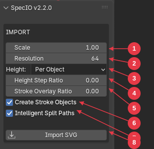
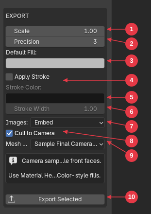
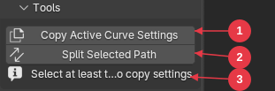
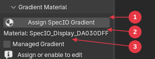
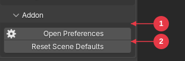

<small>Created by Anthony Aragues
# SpecIO User Manual

SpecIO is a Blender 5.1+ extension for importing and exporting SVG files. Bring vector artwork into Blender as editable curves, text, and image planes — and write Blender curves, text, image planes, and even camera-view 3D scenes back out as clean SVG.

## Contents

1. [Installation](#1-installation)
2. [The SVG Sidebar](#2-the-svg-sidebar)
3. [Importing SVG](#3-importing-svg)
4. [Exporting SVG](#4-exporting-svg)
5. [Tools](#5-tools)
6. [Managed Gradient Workflow](#6-managed-gradient-workflow)
7. [Settings Reference](#7-settings-reference)
8. [SVG Support](#8-svg-support)
9. [Troubleshooting](#9-troubleshooting)
10. [Reporting Bugs](#10-reporting-bugs)

## Quick Start

1. Install and enable SpecIO from `Edit > Preferences > Extensions`.
2. Open the 3D Viewport and press `N` to open the sidebar. Click the **SVG** tab. The panel header reads `SpecIO v<version>`.
3. In the **IMPORT** section, click `Import SVG` and choose a `.svg` file. Imported geometry appears as Blender curves, text objects, and image planes inside a collection named `<filename>_SVG`.
4. To export, select one or more curve, text, or image objects and click `Export Selected` in the **EXPORT** section.
5. To export 2D silhouettes of 3D meshes, switch the viewport to camera view (`Numpad 0`), select the meshes, and click `Export Selected`.

---

## 1. Installation

SpecIO requires **Blender 5.1.0 or newer**. It does not install in older Blender versions.

Operating systems: Windows, macOS, and Linux. Windows is the primary validated platform.

### Install from a built `.zip`

1. Obtain a built SpecIO extension `.zip` (release artifact or your own build).
2. In Blender, open `Edit > Preferences > Extensions`.
3. Click the dropdown at the top right and choose `Install from Disk...`.
4. Select the SpecIO `.zip` file.
5. Tick the checkbox next to **SpecIO** in the extensions list to enable it.

### Verify the install

1. Open the 3D Viewport.
2. Press `N` to open the sidebar.
3. You should see an **SVG** tab containing a panel titled `SpecIO v2.2.0` (or your installed version).

If the SVG tab is missing, return to `Edit > Preferences > Extensions`, search for "SpecIO", and confirm the checkbox is enabled.

### Uninstall

1. In `Edit > Preferences > Extensions`, find SpecIO.
2. Untick the checkbox to disable, or use the dropdown menu next to it to remove the extension entirely.

Disabling does not delete imported curves, text, image planes, or assigned gradient materials from any saved `.blend` file. Re-enabling SpecIO restores the panel and you can keep working with previously imported objects.

---

## 2. The SVG Sidebar

All SpecIO controls live in the 3D Viewport's N-panel sidebar, under the **SVG** tab. Press `N` in the 3D Viewport to toggle it.

The tab contains a single panel whose title shows the addon version (e.g. **SpecIO v2.2.0**). Inside it are two boxed action sections — **IMPORT** and **EXPORT** — drawn in the main panel itself, plus three collapsible sub-panels below:

| Section | Where | Purpose |
|---|---|---|
| IMPORT | Boxed section in the main panel | Import-time settings + the **Import SVG** button |
| EXPORT | Boxed section in the main panel | Export-time settings + the **Export Selected** button |
| Tools | Sub-panel | Curve utilities: **Copy Active Curve Settings**, **Split Selected Path** |
| Gradient Material | Sub-panel | Assign and edit SpecIO-managed SVG gradients on the active curve |
| Addon | Sub-panel | Open addon preferences and reset per-scene settings |

The **Tools**, **Gradient Material**, and **Addon** sub-panels are collapsed by default. Click a sub-panel header to expand or collapse it.

> The sidebar is only visible in **Object Mode**. It does not appear in Edit, Sculpt, or Pose mode.

### IMPORT section

A boxed section at the top of the main panel.

1. **Scale** — multiplier applied to imported geometry.
2. **Resolution** — curve resolution hint (reserved for future use).
3. **Height** — Z-stacking mode for imported objects (`Flat`, `Per Object`, `Per Layer`).
4. **Height Step Ratio** — Z spacing between stacked objects, as a fraction of the SVG document size.
5. **Stroke Overlay Ratio** — Z clearance between a fill object and its stroke helper.
6. **Create Stroke Objects** — when on, shapes that have both fill and stroke import as two objects (a fill curve and a separate stroke helper).
7. **Intelligent Split Paths** — when on, complex paths with holes may be split into separate objects so they fill correctly.
8. **Import SVG** button — opens a file browser to choose the `.svg` file to import.

> **Note:** `Height Step Ratio` and `Stroke Overlay Ratio` default to `0.001` but display as `0.00` in the panel because Blender rounds float displays to two decimals. The underlying value is what the importer uses.

### EXPORT section

A boxed section below IMPORT.

1. **Scale** — multiplier applied to exported geometry.
2. **Precision** — decimal places written for SVG numbers (0–10).
3. **Default Fill** — fallback fill color when an object has no preserved SVG fill or material color.
4. **Apply Stroke** — when on, exported objects without an explicit stroke get a default stroke. Enables fields 5 and 6.
5. **Stroke Color** — color used by Apply Stroke (only active when Apply Stroke is on).
6. **Stroke Width** — width used by Apply Stroke.
7. **Images** — `Embed` (base64 inline) or `Link` (relative file path) for raster image export.
8. **Cull to Camera** — drop geometry that is entirely outside the camera viewport during camera export.
9. **Mesh Color** — `Material Heuristic` (use Base Color directly) or `Sample Final Camera Color` (render Eevee and sample the lit color per face). When `Sample Final Camera Color` is selected, an info box appears warning that camera sampling keeps only visible front faces.
10. **Export Selected** button — opens a file browser to choose the output `.svg` path.

### Tools sub-panel

1. **Copy Active Curve Settings** — copies curve display settings (2D/3D mode, extrude, bevel, fill) from the active curve to the other selected curves.
2. **Split Selected Path** — splits the active multi-spline curve into separate Blender objects in a new collection.
3. **Context-sensitive hint** — shown below the buttons when the current selection isn't valid for an operator. Possible messages:
   - *"Select target curves, then make the source active"* — no curve is active
   - *"Select at least two curves to copy settings"* — fewer than two curves are selected
   - *"Selected path has one spline"* — Split Selected Path would have nothing to split

### Gradient Material sub-panel

1. **Assign SpecIO Gradient** — creates and assigns a managed gradient material to all selected curve objects.
2. **Material name label** — shows which material is currently being edited (the active curve's first material slot).
3. **Managed Gradient** toggle — enables the full gradient editor below. When off, the material is treated as a regular Blender material at export time, and the hint *"Assign or enable to edit"* is shown instead of the editor.

If no curve is selected, only the **Assign SpecIO Gradient** button is shown. The full gradient editor (color stops, geometry, spread mode) only appears when a managed gradient is enabled — see [§6 Managed Gradient Workflow](#6-managed-gradient-workflow) for the editor in detail.

### Addon sub-panel

1. **Open Preferences** — jumps to SpecIO's section of the Blender addon preferences window.
2. **Reset Scene Defaults** — re-applies addon preference defaults to the current scene's SpecIO settings, overwriting any per-scene changes.

---

## 3. Importing SVG

The **Import SVG** action reads a `.svg` file and creates Blender objects in a new collection named `<filename>_SVG`. The collection is added under the active scene collection.

### Running the import

1. Open the **SVG** sidebar tab.
2. In the **IMPORT** section, review the import settings (see below).
3. Click **Import SVG**.
4. Choose a `.svg` file in the file browser. Click **Import SVG** to confirm.

When the import succeeds, the newly created objects are selected and the first one becomes the active object. A success message appears in the status bar. On failure, an error message starting with *"Failed to import SVG:"* is reported and nothing is created.

A single `Ctrl+Z` after import removes everything the import created.

### What gets created

| SVG element | Becomes |
|---|---|
| `<svg>`, `<g>` | Blender collections (group hierarchy is preserved) |
| `<rect>`, `<circle>`, `<ellipse>`, `<line>`, `<polyline>`, `<polygon>`, `<path>` | Blender curve objects |
| `<text>` | Blender text objects |
| `<image>` (local file or embedded data) | Blender mesh planes with the image as a texture |
| `<linearGradient>`, `<radialGradient>` | Blender materials with a node-based preview |
| `<use>` referencing a local element/group/symbol | Inline-expanded clones of the referenced content |
| Hidden elements (`display:none`, `visibility:hidden`) | Skipped entirely |

Element groups become Blender collections. SVG `id` attributes are preserved as collection and object names where valid. When an `id` is missing, SpecIO assigns a stable fallback name (`path_1`, `group_2`, etc.) so re-imports are predictable.

### What's preserved on import

- All standard SVG path commands (move, line, cubic/quadratic Bezier, arc, close).
- Fill, stroke, stroke width, line caps, line joins, opacity.
- Inline `style="..."`, inherited styles, and CSS `<style>` blocks.
- Hidden elements are skipped (via `display:none`, `visibility:hidden`, or `fill:none` + `stroke:none`).
- All affine transforms (`translate`, `scale`, `rotate`, `matrix`, `skewX/Y`) including nested group transforms.

When a shape has both a fill and a stroke, SpecIO can create **two** Blender objects for it: the fill object and a *stroke helper* object placed slightly below the fill in Z. This keeps fill and stroke independently editable. Turn off **Create Stroke Objects** to disable.

### Import settings

These live in the **IMPORT** section of the SVG sidebar.

#### Scale

Multiplier from SVG user units to Blender units. Default `1.0`. Range `0.001` to `1000.0`.

A 100×100 SVG drawn at scale `1.0` becomes 100 Blender units wide. Use `0.01` to map an SVG to roughly metric centimeters in a small scene.

#### Resolution

Default `64`. Reserved field; carried through but not currently used for spline subdivision (paths are constructed from real Bezier handles).

#### Height (Z stacking mode)

- **Flat** — every imported object has the same Z position (0).
- **Per Object** — each imported object is offset by **Height Step Ratio** × document size, in document order. Avoids z-fighting between stacked filled shapes.
- **Per Layer** — each top-level SVG layer or group gets one Z step; objects inside a layer share that Z. Useful for multi-layer Illustrator/Inkscape files.

Default: **Per Object**.

#### Height Step Ratio

The Z step used by **Per Object** and **Per Layer**, expressed as a fraction of the SVG document's largest dimension. Default `0.001` (about 0.1%).

Set to `0.0` to keep all objects on the same plane while still using the stacking mode field for layout intent.

#### Stroke Overlay Ratio

Z clearance between a fill object and its stroke helper. Same units as **Height Step Ratio**. Default `0.001`.

This puts the stroke helper slightly *below* the fill so it shows behind the fill outline, matching SVG's draw-order convention.

#### Create Stroke Objects

When **on** (default), shapes with both fill and stroke import as two Blender objects: the fill curve and a stroke helper named `<id>_stroke`.

When **off**, only the fill object is created and the stroke style is dropped at import time. Turn this off if your SVG has many fills+strokes and you only need fill geometry, or if stroke duplicates clutter your outliner.

#### Intelligent Split Paths

When **on** (default), the importer analyzes complex paths with holes and may split them into separate Blender objects per contour family, so each closed region renders correctly as a fill instead of getting confused by hole/outer-ring nesting.

When **off**, every SVG `<path>` becomes exactly one Blender curve object with all its splines preserved literally. Disable this if you want the simplest possible 1:1 element mapping at the cost of correct rendering of compound fills.

The same logic powers the manual **Split Selected Path** tool — see [Tools](#5-tools).

### What the importer does not do

See [SVG Support](#8-svg-support) for the full list. Highlights:

- **No remote raster images.** `<image href="http://...">` (and `https://`, `ftp://`) are skipped for security. Local files and `data:` URIs work.
- **No script execution.** Embedded `<script>` content is ignored.
- **No `<tspan>`, `<textPath>`, `<clipPath>`, `<mask>`, filters, or animation.**
- `<use>` only resolves references to other elements within the same file.
- General SVG unit conversion (mm/pt/in) is not implemented. SpecIO honors `viewBox` for sizing.

### Re-importing a file

Re-importing the same file creates a *new* `<filename>_SVG` collection and new objects each time. SpecIO does not deduplicate. To replace an import, delete the old collection (and its child objects) before re-importing.

---

## 4. Exporting SVG

The **Export Selected** action writes selected Blender objects to a `.svg` file. SpecIO supports four kinds of source content in a single export:

1. **Curve objects** — exported as SVG `<path>` data.
2. **Text objects** — exported as SVG paths derived from the text geometry.
3. **Image planes** — exported as SVG `<image>` elements (embedded base64 or linked file).
4. **Mesh objects** — exported as **2D camera-projected silhouettes** when the viewport is in camera view.

You can mix all four in one export. Original SVG sibling order is preserved when available, so re-exporting an imported SVG produces stable, predictable output.

### Running the export

1. Select the objects you want to export. Selection rules differ by mode (see below).
2. Open the **SVG** sidebar tab. The **EXPORT** section is below **IMPORT**.
3. Review the export settings.
4. Click **Export Selected**.
5. Pick an output path. The file extension must be `.svg`.

On success, the status bar shows *"Successfully exported SVG to: \<path\>"*. On failure it shows the reason.

### What can be exported

| Selected object | Exported as | Notes |
|---|---|---|
| Curve with at least one spline | SVG `<path>` | Stroke helpers are skipped — their styling rejoins the fill object on export |
| Text object | SVG `<path>` | Position, transform, font size, and text alignment are converted back |
| Image plane (created by SpecIO import) | SVG `<image>` | Mode controlled by the **Images** setting (Embed or Link) |
| Mesh | 2D camera silhouette path(s) | Requires an active scene camera and the 3D viewport in camera view |

If you select only meshes without a camera-view viewport, the operator reports an error before opening the file browser:

- *"Active scene camera required for SVG export"* — set a camera in the scene.
- *"SVG export requires the active 3D viewport to be in camera perspective"* — press `Numpad 0` in the viewport.

If you select objects but none of them match an exportable type, you get *"Select at least one curve, text, or image object to export…"*

### Camera-projected export

Whenever the viewport is in camera perspective and a scene camera is set, **all** selected geometry is projected through the camera into 2D SVG space:

- Curve and text objects are projected using their world coordinates through the camera matrix.
- Mesh objects are silhouetted face-by-face (front-facing polygons only) and written as filled paths.
- Image planes are projected too.

If the viewport is **not** in camera perspective (or there is no scene camera), curves/text/images export using their XY world coordinates directly, and meshes are not exportable.

The exported SVG document size matches the camera's render resolution (multiplied by the export **Scale**). If the render is set to 1920×1080 and Scale is `1.0`, the SVG `viewBox` will be 1920×1080.

#### Cull to Camera

When **on** (default), geometry whose projected bounding box falls entirely outside the camera viewport is dropped from output. This keeps off-screen content out of large camera-export files.

When **off**, off-screen content is exported as-is and may produce SVG paths outside the document bounds.

#### Mesh Color Mode

- **Material Heuristic** (default) — read the assigned material's Base Color directly. Fast, deterministic, ignores lighting. Best when you want flat editorial-style fills.
- **Sample Final Camera Color** — render the scene with Eevee from the active camera, then sample the lit color at each face's projected centroid. Produces shaded-looking output. Slower; only front-facing polygons whose centroid is visible to the camera are kept.

When **Sample Final Camera Color** is selected, the panel shows an info banner reminding you of these tradeoffs.

### Selection persistence across the file browser

When you click **Export Selected**, SpecIO remembers the names of currently selected objects and uses them if the file browser changes the active selection. You can click the button, navigate the file dialog, and the export will still target the objects you had highlighted in the viewport.

### Export settings

#### Scale

Multiplier from Blender units to SVG user units. Default `1.0`.

#### Precision

Decimal places written for SVG numbers. Default `3`. Range `0` to `10`. Lower values produce smaller files at the cost of geometric precision.

#### Default Fill

Fallback fill color used when an exported object has neither a preserved SVG fill (from import) nor a Blender material color to derive from. Default medium gray.

#### Apply Stroke

When **on**, exported objects without an explicit SVG stroke get a default stroke applied. Off by default. The **Stroke Color** and **Stroke Width** fields below it become editable.

#### Images

How to write `<image>` elements:

- **Embed** (default) — base64-encode the image bytes inline in the SVG file. Self-contained file; larger size.
- **Link** — write a relative file path reference. Smaller SVG; requires the linked image to stay alongside the SVG.

#### Cull to Camera, Mesh Color

See [Camera-projected export](#camera-projected-export).

### Round-trip behavior

When you export objects that were originally imported by SpecIO:

- SVG ids are preserved.
- Sibling order from the original document is respected.
- Group hierarchy is reconstructed from collection nesting.
- Imported gradients are written back into a `<defs>` block.
- Stroke helper objects automatically rejoin their fill on export — you do not need to deselect them.

When you export objects you created in Blender (no SpecIO import history):

- Object names become SVG ids.
- Collections become `<g>` groups.
- Material colors (or the **Default Fill**) become SVG fills.
- Output is deterministic — re-exporting the same scene produces the same SVG when scene data is unchanged.

### What does not export

- Modifiers (Subsurf, Bevel, etc. on curves) are not evaluated for export. The exported path uses the source spline geometry. Apply modifiers first if you need them in the output.
- Animation, drivers, and constraints do not export.
- Shape keys and grease pencil are not supported.
- Mesh exports do not write 3D depth information; they are flat 2D silhouettes only.

---

## 5. Tools

The **Tools** sub-panel contains two curve utilities.

### Copy Active Curve Settings

Copies curve display settings from the active curve onto every other selected curve. Each target curve keeps its own splines while picking up shared display, extrude, bevel, and fill settings.

What gets copied:

- 2D / 3D mode
- Extrude depth
- Bevel depth, bevel resolution, bevel object/profile
- Fill mode
- Resolution settings
- Twist mode and smoothing
- Other curve display flags

What is **not** copied: the actual spline geometry, materials, animation, or shape keys.

#### When to use it

After importing or authoring multiple curves and you want them all to share the same extrusion / bevel / 2D-3D mode without re-clicking through the properties for each one. Common workflow: tweak one curve's settings until it looks right, then propagate.

#### Running it

1. Select all the curves you want to **change**.
2. Make the curve whose settings you want to **copy** the active object (last clicked, brighter outline).
3. Open the **SVG** sidebar tab and expand **Tools**.
4. Click **Copy Active Curve Settings**.

#### Status messages

| Outcome | Message |
|---|---|
| Copied to N targets | *Copied active curve settings to N target(s)* |
| Copied with some skipped (linked data) | *Copied... ; skipped M linked target(s)* |
| Active object missing or not a curve | Error: *Active object must be a curve source* |
| No other curves selected | Error: *Select at least one target curve and make the source curve active* |
| All targets share the source's data | Warning: *Selected target curves already share the active curve data* |

The "linked" case happens when targets were created via `Object > Link/Transfer Data > Link Object Data` (or `Alt+D`-style instancing). Those targets already mirror every change to the source, so copying would do nothing.

### Split Selected Path

Splits the active curve's splines into separate Blender objects. The split is smart — it uses the same logic as **Intelligent Split Paths** during import, so nested contour groups (an outer ring with its inner holes) stay grouped together instead of becoming one object per spline.

The new objects are placed in a new collection named after the source object.

#### When to use it

- After importing an SVG with **Intelligent Split Paths** turned off, when a complex multi-spline path needs separating after the fact.
- When you want to edit individual contours of a compound path independently.
- When you need to apply different materials, modifiers, or transforms to subsets of a multi-spline curve.

#### Running it

1. Select a single curve object that contains **at least two splines**. Make sure it is the active object.
2. Open the **SVG** sidebar tab and expand **Tools**.
3. Click **Split Selected Path**.

After running:

- All split parts are selected.
- The first split part becomes the active object.
- The status bar reports how many objects were created and the new collection name.

#### Errors

| Condition | Result |
|---|---|
| No active object, or active object is not a curve | Error: *Select a curve object to split* |
| Active curve has only one spline | Error: *Selected curve must contain at least two splines* |
| Splitter ran but produced no parts | Warning: *No split parts were created* |

A single `Ctrl+Z` removes the new collection and split objects and restores the original curve.

---

## 6. Managed Gradient Workflow

SpecIO can both *reconstruct* SVG gradients on import and *author* them in Blender for export. The authoring side is called the **managed gradient workflow**: assign a SpecIO-managed material to a curve, edit its parameters in the sidebar, and on export the material is written back as a real SVG `<linearGradient>` or `<radialGradient>`.

The managed material also previews in Blender (Material Preview / Eevee), so you can iterate visually before exporting.

### When to use it

- You want to draw a gradient-filled shape in Blender for SVG output.
- An imported SVG gradient needs editing.
- You want round-trip control over gradient ids written into the SVG.

### Assigning a managed gradient

1. Select one or more curve objects in the 3D Viewport.
2. Open the **SVG** sidebar tab and expand the **Gradient Material** sub-panel.
3. Click **Assign SpecIO Gradient**.

Each selected curve gets a new managed material placed in slot 0 (replacing whatever was in slot 0). Defaults: linear gradient, fill paint target, white-to-dark-gray, full opacity, pad spread, anchored horizontally across the object.

If you select no curves and click the button, the operator reports *"Select at least one curve object"*.

The status bar reports *"Assigned SpecIO gradient material to N object(s)"* on success.

### Editing the managed gradient

With a curve selected whose first material slot holds a managed gradient, the **Gradient Material** sub-panel shows the editor:

#### Top row

- **Material:** *(label only — shows the name of the active material being edited)*
- **Managed Gradient** — toggle SpecIO gradient management on this material. When off, the material is treated as a regular Blender material at export time.

#### Identification and behavior

- **Paint Target** — `Fill` or `Stroke`. Determines whether this material exports as the SVG fill or stroke. Default `Fill`.
- **Gradient ID** — optional override for the SVG gradient id. Leave blank to derive automatically from the material name.
- **Type** — `Linear` or `Radial`.
- **Spread** — `Pad` (clamp at the ends), `Repeat` (tile the pattern), or `Reflect` (mirror-tile). Default `Pad`.

#### Color stops

The managed gradient editor exposes **two stops** (start and end). Each has color, alpha, and offset (0..1).

- **Start Color**, **Start Alpha**, **Start Offset** (default offset `0.0`)
- **End Color**, **End Alpha**, **End Offset** (default offset `1.0`)

#### Linear gradient geometry

When **Type = Linear**:

- **X1**, **Y1** — start point of the gradient line
- **X2**, **Y2** — end point

Defaults: `(0,0)` to `(1,0)` (left-to-right horizontal).

#### Radial gradient geometry

When **Type = Radial**:

- **Center X**, **Center Y** — center of the gradient circle (default `0.5, 0.5`)
- **Radius** — radius of the gradient circle (default `0.5`)
- **Focal X**, **Focal Y** — focal point inside the circle, where 0% offset begins (default `0.5, 0.5`)

### How edits propagate

Every property in the managed gradient editor updates **live**. When you change any value, the underlying material's preview updates and the gradient is ready for the next export. There is no separate "Apply" step.

### Importing existing gradients

When SpecIO imports an SVG that contains `<linearGradient>` or `<radialGradient>` definitions:

- The gradient is parsed and its full data (stops, transform, spread method, geometry) is stored on the assigned Blender material.
- A node tree is built so the gradient previews in Blender.
- On export, the original gradient is written back to the SVG `<defs>` block — multi-stop gradients survive a roundtrip even though the panel UI only edits two stops directly.

### Limits

- One material slot per curve is read on export (slot 0). Move your gradient material into slot 0 if it isn't already.
- The panel exposes two color stops; multi-stop gradients survive roundtrip but cannot be edited in the UI.
- Gradient transforms are preserved on roundtrip but not editable in the UI.
- Mesh objects and text objects do not currently use managed gradient materials for export — they fall back to material color sampling.

---

## 7. Settings Reference

SpecIO has two layers of settings:

1. **Addon preferences** — global defaults applied to new scenes. Edited in `Edit > Preferences > Add-ons > SpecIO` (or via the **Open Preferences** button in the **Addon** sub-panel).
2. **Scene settings** — per-scene values used by the import and export operators. Edited in the **IMPORT** and **EXPORT** sections of the SVG sidebar.

When you first interact with SpecIO in a new scene, the addon preferences are copied into the scene. After that, scene values are independent. Click **Reset Scene Defaults** in the **Addon** sub-panel to re-sync from preferences.

### Addon preferences

`Edit > Preferences > Extensions > SpecIO`. Three sections.

#### Import defaults

| Field | Default | Range |
|---|---|---|
| Default Import Scale | `1.0` | `0.001`–`1000.0` |
| Default Resolution | `64` | `1`–`512` |
| Default Height Mode | Per Object | Flat / Per Object / Per Layer |
| Default Height Step Ratio | `0.001` | `0.0`–`100.0` |
| Default Stroke Clearance Ratio | `0.001` | `0.0`–`100.0` |
| Default Create Stroke Objects | On | toggle |
| Default Intelligent Split Paths | On | toggle |

#### Export defaults

| Field | Default | Range |
|---|---|---|
| Default Export Scale | `1.0` | `0.001`–`1000.0` |
| Precision | `3` | `0`–`10` |
| Default Fill Color | medium gray | RGB |
| Apply Stroke On Export | Off | toggle |
| Default Stroke Color | black | RGB |
| Default Stroke Width | `1.0` | `0.001`–`1000.0` |
| Cull to Camera on Export | On | toggle |
| Default Mesh Color Mode | Material Heuristic | Material Heuristic / Sample Final Camera Color |

#### Library settings

| Field | Default | Description |
|---|---|---|
| Use SVGElements Library | On | Reserved toggle for an optional SVG parser library. Leave on. |

### Scene settings

These appear in the **IMPORT** and **EXPORT** sections of the SVG sidebar. They take their initial values from the addon preferences above.

| Section | Field | Default | Range |
|---|---|---|---|
| IMPORT | Scale | `1.0` | `0.001`–`1000.0` |
| IMPORT | Resolution | `64` | `1`–`512` |
| IMPORT | Height | Per Object | Flat / Per Object / Per Layer |
| IMPORT | Height Step Ratio | `0.001` | `0.0`–`100.0` |
| IMPORT | Stroke Overlay Ratio | `0.001` | `0.0`–`100.0` |
| IMPORT | Create Stroke Objects | On | toggle |
| IMPORT | Intelligent Split Paths | On | toggle |
| EXPORT | Scale | `1.0` | `0.001`–`1000.0` |
| EXPORT | Precision | `3` | `0`–`10` |
| EXPORT | Default Fill | medium gray | RGB |
| EXPORT | Apply Stroke | Off | toggle |
| EXPORT | Stroke Color | black | RGB |
| EXPORT | Stroke Width | `1.0` | `0.001`–`1000.0` |
| EXPORT | Images | Embed | Embed / Link |
| EXPORT | Cull to Camera | On | toggle |
| EXPORT | Mesh Color | Material Heuristic | Material Heuristic / Sample Final Camera Color |

### Managed gradient material settings

Visible in the **Gradient Material** sub-panel when the active object's first material slot holds a managed gradient.

| Field | Default | Notes |
|---|---|---|
| Managed Gradient | Off | Master toggle for SpecIO gradient management |
| Paint Target | Fill | Fill or Stroke |
| Gradient ID | *(blank)* | Optional explicit SVG id |
| Type | Linear | Linear or Radial |
| Spread | Pad | Pad / Repeat / Reflect |
| Start Color | white | RGB |
| Start Alpha | `1.0` | `0.0`–`1.0` |
| Start Offset | `0.0` | `0.0`–`1.0` |
| End Color | very dark gray | RGB |
| End Alpha | `1.0` | `0.0`–`1.0` |
| End Offset | `1.0` | `0.0`–`1.0` |
| X1 / Y1 / X2 / Y2 (Linear) | `(0, 0)` to `(1, 0)` | Each axis `-4.0`–`4.0` |
| Center X / Y, Radius, Focal X / Y (Radial) | center `(0.5, 0.5)`, radius `0.5`, focal `(0.5, 0.5)` | Position `-4.0`–`4.0`, radius `0.001`–`4.0` |

---

## 8. SVG Support

A practical, per-feature summary of what SpecIO supports today.

### Containers and structure

| Element | Import | Export | Notes |
|---|---|---|---|
| `<svg>` | ✓ | ✓ | Root document; `viewBox` honored for sizing |
| `<g>` | ✓ | ✓ | Becomes a Blender collection; sibling order preserved |
| `<defs>` | ✓ (indexed) | ✓ | Used for gradients and `<use>` lookups |
| `<symbol>` | ✓ (indexed) | — | Resolved when referenced by `<use>` |
| `<use href="#id">` | ✓ | — | Local references only; expanded inline at import time |
| `<style>` (CSS block) | ✓ | — | Parsed and applied at import |

### Vector geometry

| Element | Import | Export source |
|---|---|---|
| `<rect>` (incl. rounded corners) | ✓ | Curves |
| `<circle>` | ✓ | Curves |
| `<ellipse>` | ✓ | Curves |
| `<line>` | ✓ | Curves |
| `<polyline>` | ✓ | Curves |
| `<polygon>` | ✓ | Curves |
| `<path>` | ✓ | Curves and Text |

Exported geometry is always written as `<path>` for curves and text, regardless of the source SVG primitive.

### Path commands

Supported on both import and export. Lowercase variants (relative coordinates) are equivalent to their uppercase counterparts.

| Command | Meaning |
|---|---|
| `M` / `m` | Move to |
| `L` / `l` | Line to |
| `H` / `h` | Horizontal line |
| `V` / `v` | Vertical line |
| `C` / `c` | Cubic Bezier |
| `S` / `s` | Smooth cubic Bezier |
| `Q` / `q` | Quadratic Bezier |
| `T` / `t` | Smooth quadratic — *normalized to cubic* on import |
| `A` / `a` | Arc — *normalized to cubic* on import |
| `Z` / `z` | Close path |

> **Round-trip note:** an SVG that uses `T` or `A` will export as cubic curves. The geometry is preserved; the textual command form is not.

### Text

| Feature | Import | Export | Notes |
|---|---|---|---|
| `<text>` content | ✓ | ✓ | Becomes Blender text object; exports as path |
| `x` / `y` position | ✓ | ✓ | |
| `transform` | ✓ | ✓ | Applied as Blender object transform |
| `font-size` | ✓ | ✓ | Pixels assumed if no unit given |
| `text-anchor` | ✓ | ✓ | Left / Middle / Right alignment |
| `<tspan>` | ✗ | ✗ | Not supported |
| `<textPath>` | ✗ | ✗ | Not supported |
| Multi-line / wrapping | Limited | Limited | Single-line text content only |

Text objects extruded or beveled in Blender export as path silhouettes when in camera-projected mode.

### Raster images

| Source | Import | Export |
|---|---|---|
| Local file path (relative or absolute) | ✓ | ✓ (Embed or Link mode) |
| `data:image/...;base64,...` URIs | ✓ | ✓ |
| `http://`, `https://`, `ftp://` | ✗ rejected (security) | — |

Supported image MIME types: PNG, JPEG, WebP, GIF, BMP, TIFF.

### Paint and presentation

| Attribute / style | Import | Export |
|---|---|---|
| `fill` (named, hex, rgb, currentColor, none) | ✓ | ✓ |
| `stroke` | ✓ | ✓ |
| `stroke-width` | ✓ | ✓ |
| `stroke-linecap` | ✓ | ✓ |
| `stroke-linejoin` | ✓ | ✓ |
| `fill="none"`, `stroke="none"` | ✓ | ✓ |
| `display="none"`, `visibility="hidden"` | ✓ (skipped) | — |
| Inline `style="..."` | ✓ | — |
| Inherited styles from parent elements | ✓ | — |
| CSS `<style>` rules | ✓ | — |
| `fill-rule` (`evenodd`) | ✓ | Partially preserved |
| `opacity`, `fill-opacity`, `stroke-opacity` | ✓ | ✓ |

### Gradients

| Feature | Import | Export |
|---|---|---|
| `<linearGradient>` | ✓ | ✓ |
| `<radialGradient>` | ✓ | ✓ |
| `gradientTransform` | ✓ preserved | ✓ written back |
| `spreadMethod` (pad / repeat / reflect) | ✓ | ✓ |
| Multi-stop gradients | ✓ | ✓ (UI edits 2 stops) |
| `fill="url(#id)"` / `stroke="url(#id)"` | ✓ | ✓ |

See [Managed Gradient Workflow](#6-managed-gradient-workflow) for authoring details.

### Transforms

| Transform | Import | Export |
|---|---|---|
| `translate(...)` | ✓ | ✓ |
| `scale(...)` | ✓ | ✓ |
| `rotate(...)` | ✓ | ✓ |
| `matrix(...)` | ✓ | ✓ |
| `skewX(...)`, `skewY(...)` | ✓ | ✓ |
| Nested transforms in `<g>` chains | ✓ | ✓ |

### Units

| Source | Behavior |
|---|---|
| Unitless coordinates | ✓ treated as user units |
| `viewBox` | ✓ honored for sizing |
| `width` / `height` with units (`px`, `mm`, `pt`, `in`) | Partial — full unit conversion not implemented |
| `%` values | ✗ not supported |

For predictable results, ensure your source SVG uses an explicit `viewBox` and unitless or pixel coordinates.

### Camera-view export (Blender → SVG)

| Source object | Supported |
|---|---|
| Curves | ✓ (always; projected when in camera view) |
| Text | ✓ (projected when in camera view) |
| Image planes | ✓ (projected when in camera view) |
| Meshes | ✓ — front-facing polygons silhouetted as filled paths |
| Grease Pencil | ✗ |
| Volumes / particles | ✗ |
| Modifiers (Subsurf, Bevel, etc.) | ✗ — not evaluated for export |

### Explicitly NOT supported

These elements/features are recognized but ignored, or actively unsupported:

- `<tspan>`, `<textPath>` (text styling beyond simple `<text>`)
- `<clipPath>`, `<mask>` (clipping and masking)
- SVG filters
- SVG animation (SMIL)
- `<script>` content (intentionally not executed)
- Remote raster images (`http://`, `https://`, `ftp://`)
- Full unit conversion (`mm`, `pt`, `in`, `%`)
- Multi-line text wrapping inside a single `<text>` element
- External stylesheet references

If your SVG depends on any of these, expect missing or simplified geometry on import. The importer skips unsupported elements rather than fail.

### Round-trip predictability

When you export an unmodified SpecIO-imported scene:

- Group hierarchy and sibling order match the source
- SVG ids are preserved
- Numeric output is stable for the same precision setting

Path commands may normalize (`T` → cubic, `A` → cubic), so the exported file is geometrically equivalent but not byte-identical to the source.

---

## 9. Troubleshooting

### Install / enable

#### The SVG sidebar tab is missing

- Confirm Blender is **5.1 or newer**.
- Open `Edit > Preferences > Extensions`, search for "SpecIO", and verify the checkbox is ticked.
- Press `N` in the 3D Viewport — the sidebar may be hidden.
- The sidebar only shows in **Object Mode**. Switch out of Edit/Sculpt/Pose mode.

#### Registration errors when enabling

- Make sure no older copy of SpecIO is also installed (a leftover from a manual install can collide with the extension install).
- Restart Blender after uninstalling stale copies.

### Import errors

#### *"SVG file not found: \<path\>"*

The file path passed to the importer does not exist. The file may have been moved or deleted between selection and import. Re-pick it in the file browser.

#### *"Failed to parse SVG file: \<reason\>"*

The XML is malformed. Open the SVG in a text editor or another SVG tool to verify it parses. Common causes: truncated file, mixed encodings, non-XML content saved with a `.svg` extension.

#### Imported SVG looks empty

- The file may use only unsupported elements (everything inside `<clipPath>`, `<mask>`, or filter chains). See [SVG Support](#8-svg-support).
- Hidden elements (`display:none`, `visibility:hidden`) are skipped intentionally.
- The geometry may be at extreme coordinates. Press `A` to select all, then `Numpad .` to frame everything.
- If the file uses `mm` or `in` units without a `viewBox`, the imported geometry may be at an unexpected scale. Try setting **Import > Scale** to `0.01` or the reciprocal of the document size.

#### Imported colors look wrong

- SVG fills are sRGB; Blender works in linear space. SpecIO converts on import. If colors still look off, check whether the source SVG used `currentColor` or relied on inherited CSS that the importer simplified.
- Materials use the imported color as Base Color. Switch Blender to **Material Preview** or **Rendered** view to see fills correctly.

#### Strokes appear "below" fills, behind the geometry

That's intentional. The importer creates stroke helper objects placed slightly *below* the fill in Z, matching SVG's stroke-under-fill draw order. To change the spacing, adjust **Import > Stroke Overlay Ratio**. To skip stroke helpers entirely, turn off **Import > Create Stroke Objects** before re-importing.

#### Compound paths render incorrectly (holes filled in)

Turn on **Import > Intelligent Split Paths** and re-import. If the SVG was already imported with this off, run **Tools > Split Selected Path** on the offending curve.

#### `<image>` elements did not import

- Remote URLs (`http://`, `https://`, `ftp://`) are intentionally skipped for security. Download the images and re-reference them locally.
- Local image references must resolve relative to the SVG file's directory. Confirm the linked image actually exists at that relative path.

### Export errors

#### *"Active scene camera required for SVG export"*

You selected a mesh (which only exports via camera projection) without a scene camera set. In `Properties > Scene > Scene > Camera`, assign a camera, or deselect the mesh and export only curves/text/images.

#### *"SVG export requires the active 3D viewport to be in camera perspective"*

The viewport you are exporting from is not in camera view. Press `Numpad 0` to switch to the camera view, then click **Export Selected** again.

#### *"Select at least one curve, text, or image object to export…"*

You selected nothing, or selected only objects that SpecIO does not export (armatures, lights, empties). Pick at least one curve, text, image plane, or — with a camera in camera view — a mesh.

#### *"Export path must use the .svg extension"*

The chosen output path does not end in `.svg`. Add the extension.

#### Exported SVG is empty or much smaller than expected

- If exporting in camera view, off-screen geometry was culled. Turn off **Export > Cull to Camera** to keep everything.
- Mesh objects only export front-facing polygons. Rotate the mesh, the camera, or flip face normals if needed.
- Text objects with empty strings export nothing.

#### Exported colors look washed out / too dark

- Mesh export defaults to **Material Heuristic**, which reads Base Color directly without lighting. If you want shaded colors, switch **Export > Mesh Color** to **Sample Final Camera Color** — but that requires Eevee to render and is slower.
- If **Sample Final Camera Color** doesn't match the viewport, remember that sampling always uses Eevee from the active camera regardless of viewport shading.

#### Exported file ignores Blender modifiers

Modifier evaluation is not currently part of export. Apply the modifier in Blender (`Object > Convert > Mesh` / `Curve`) before exporting.

### Round-trip issues

#### Path commands changed in the exported file

`T` (smooth quadratic) and `A` (arc) commands are normalized to cubic Bezier on import, so they export as `C` / `S` curves. Geometry is equivalent; the textual command form is not preserved.

#### `id` attribute changed

Original SVG ids are preserved when stored on the corresponding Blender object/collection. If you renamed the Blender object, the export uses the new name.

#### Stroke helpers appear in my export selection

You can leave them selected — the exporter automatically skips them and rejoins their stroke style with the matching fill object.

#### Exported SVG won't open in Illustrator/Inkscape

- Validate the file with an online SVG validator first.
- File a reproducible bug in the SpecIO issue tracker with the source `.blend` and the offending `.svg`.

### Gradient issues

#### Assigning a managed gradient overwrote my existing material

The **Assign SpecIO Gradient** operator places the new material in **slot 0**, replacing whatever was there. To keep the original, move it to a different slot before clicking the button — or reassign it after.

#### Gradient preview in Blender doesn't match the exported SVG

- Blender renders the gradient through a node tree approximation. Some SVG features (especially complex transforms and multi-stop sequences) may render slightly differently in Blender vs. an SVG renderer.
- Multi-stop gradients survive a roundtrip but the panel UI only edits two stops. Editing those two stops will discard intermediate stops.

#### Gradient does not export

- Confirm the material has **Managed Gradient** enabled in the Gradient Material sub-panel.
- The exporter reads only **slot 0** of each curve. Move the gradient material into slot 0.

### Reset to defaults

If the per-scene settings have drifted into a confusing state:

1. Open the **SVG** sidebar and expand the **Addon** sub-panel.
2. Click **Reset Scene Defaults**.

This re-syncs every per-scene SpecIO setting from the addon preferences.

---

## 10. Reporting Bugs

Issues, reproducible bugs, and feature requests:

<https://github.com/SuddenDevelopment/SpecIO/issues>

When reporting an import or export bug, include:

- the source `.svg` file (or a minimal reproduction)
- the Blender version (`Help > About`)
- the SpecIO version (visible in `Edit > Preferences > Extensions > SpecIO`)
- the exact settings used (screenshot of the IMPORT or EXPORT section of the sidebar)
- the message printed in Blender's status bar / console when the operator failed
