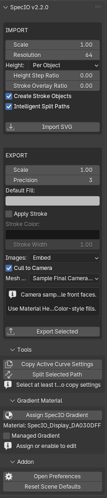

# Tools

The `Tools` sub-panel contains two curve utilities: **Copy Active Curve Settings** and **Split Selected Path**.

## Copy Active Curve Settings

Copies curve **datablock** settings from the active curve onto every other selected curve. This is the curve equivalent of Blender's "Link Object Data" — but instead of linking, it copies the writable settings, so each target curve keeps its own splines while picking up shared display/extrude/bevel/fill settings.

What gets copied (everything writable on `bpy.types.Curve` *except* the geometry itself):

- 2D / 3D mode
- Extrude depth
- Bevel depth, bevel resolution, bevel object/profile
- Fill mode (`FULL`, `BACK`, `FRONT`, `HALF`)
- Resolution U / render resolution
- Twist mode and smoothing
- Other curve display and shading flags

What is **not** copied (intentionally excluded):

- `splines` (the actual curve geometry)
- `materials`
- `name`, `users`, `original`, `override_library`, `preview`, `rna_type`
- `asset_data`, `animation_data`, `shape_keys`

### When to use it

After importing or authoring multiple curves and you want them all to share the same extrusion / bevel / 2D-3D mode without re-clicking through the properties for each one. Common workflow: tweak one curve's settings until it looks right, then propagate.

### Running it

1. Select all the curves you want to **change**.
2. Make the curve whose settings you want to **copy** the active object (last clicked, with the brighter outline).
3. Open the `SVG` sidebar tab and expand `Tools`.
4. Click `Copy Active Curve Settings`.

### Status messages

| Outcome | Message |
|---|---|
| Copied to N targets | `Copied active curve settings to <N> target(s)` |
| Copied to N, plus M targets shared the source's data | `Copied active curve settings to <N> target(s); skipped <M> linked target(s)` |
| Active object is missing or not a curve | Error: `Active object must be a curve source` |
| No other curves selected | Error: `Select at least one target curve and make the source curve active` |
| All target curves share the active curve's data | Warning: `Selected target curves already share the active curve data` |

The "linked" / "shared data" case occurs when targets were created via `Object > Link/Transfer Data > Link Object Data` (or `Alt+D`-style instancing). Those targets already see every change to the source, so copying would be a no-op and they're skipped.

### Undo

`REGISTER, UNDO`. A single `Ctrl+Z` reverts the copied settings on every target.

## Split Selected Path

Takes the active curve object and splits its splines into separate Blender objects. The split is not naive — it uses the same path-family logic the importer applies when `Intelligent Split Paths` is enabled, so nested contour groups (outer ring + inner holes that belong together) stay grouped into a single resulting object instead of becoming one object per spline.

The new objects are placed inside a new collection named after the source object.

### When to use it

- After importing an SVG with `Intelligent Split Paths` turned **off**, when a complex multi-spline path needs separating after the fact.
- When you want to edit individual contours of a compound path independently.
- When you need to apply different materials, modifiers, or transforms to subsets of a multi-spline curve.

### Running it

1. Select a single curve object that contains **at least two splines**. Make sure it is the active object.
2. Open the `SVG` sidebar tab and expand `Tools`.
3. Click `Split Selected Path`.

After running:

- All split parts are selected.
- The first split part becomes the active object.
- The status bar reports `Split path into <N> object(s) in collection <name>`.
- The new collection's name and the split objects carry the `specio_svg_split_collection` custom property so subsequent exports can recognize them.

### Error and hint conditions

| Condition | Result |
|---|---|
| No active object, or active object is not a curve | Error: `Select a curve object to split` |
| Active curve has only one spline | Error: `Selected curve must contain at least two splines` |
| Splitter ran but produced no parts | Warning: `No split parts were created` |

The Tools sub-panel itself shows hint labels under the buttons when context is incomplete:

- `Select target curves, then make the source active` — no curve is active
- `Select at least two curves to copy settings` — fewer than two curves are selected
- `Selected path has one spline` — `Split Selected Path` would be a no-op

### Settings used

The split operator reuses the active scene's import-side settings as inputs:

- `Scale` (from import scale)
- `Height Mode` and `Height Step Ratio`
- `Stroke Overlay Ratio`

It always runs with `Intelligent Split Paths = True` regardless of the scene setting — the whole point of the operator is to *intentionally* invoke that splitting logic on demand.

### Undo

`REGISTER, UNDO`. A single `Ctrl+Z` removes the new collection and split objects and restores the original curve.
